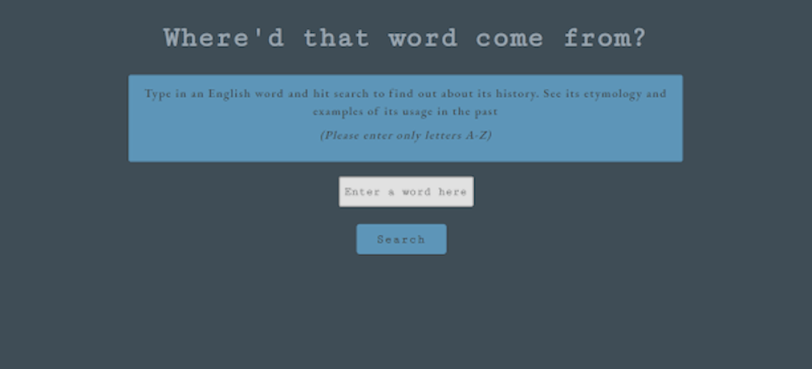
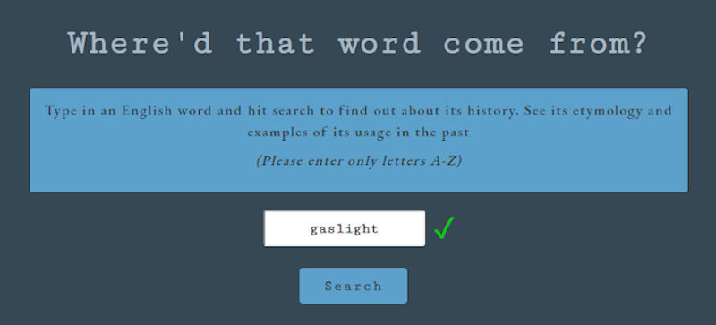
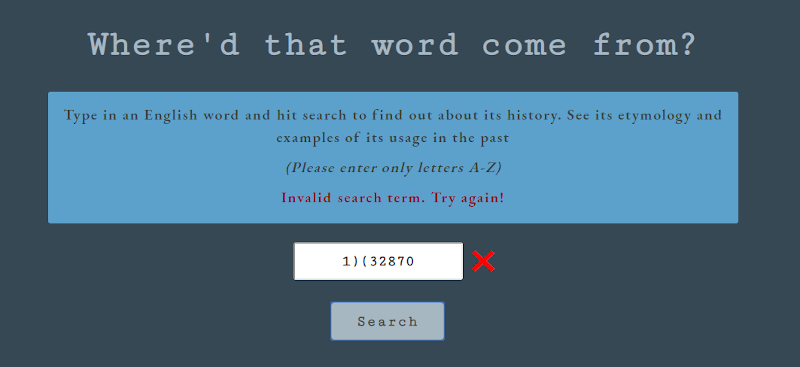
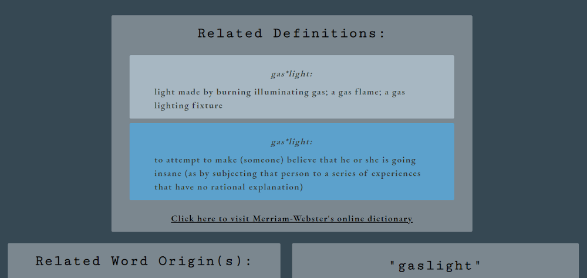
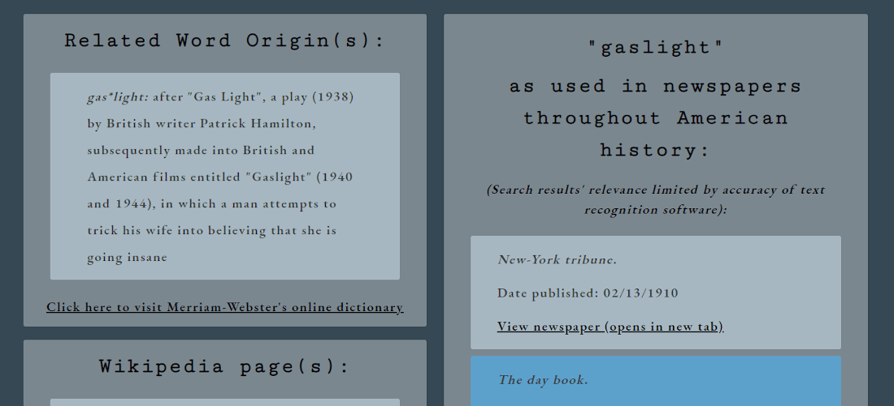
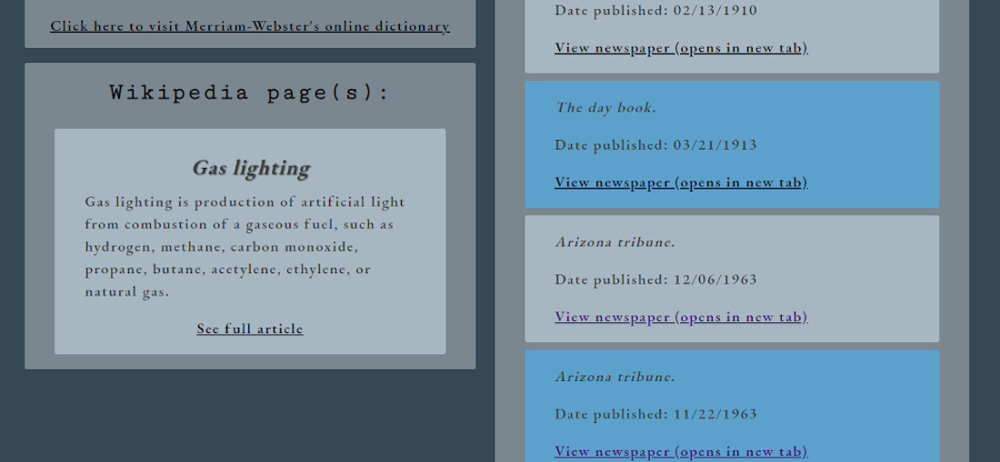

## Where'd that Word Come From?

Live App

<https://amypepper.github.io/word-origin-app/>

## Screenshots

Landing page

Visual and text search validation

Definitions results for the searched word

Etymological results for the searched word

Wikipedia article about the searched word

## Summary

This app allows you to search for any word in English that you would like to learn about the origins of. It will return and display definitions and etymologies from Merriam-Webster's Dictionary. It will also show results from Wikipedia (if there is a wikipedia article with that entry), either a disambiguation or a page summary. Finally, it will display 10 newspapers that contain the searched word that have been archived in the Library of Congress and are available online. The app gives you links to follow to view further information whenever relevant.

## Technologies Used

- jQuery
- Javascript
- HTML
- CSS
